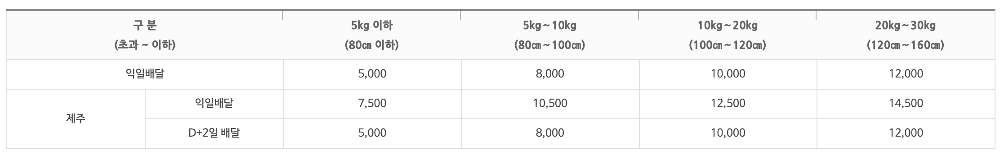
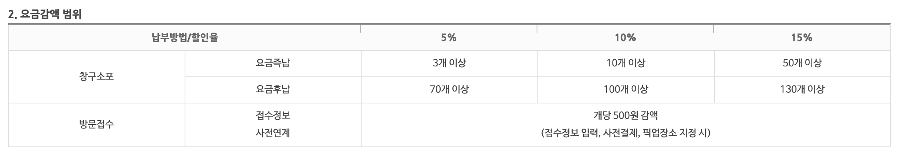

# 개요

> [우체국 요금안내 페이지](https://parcel.epost.go.kr/parcel/use_guide/charge_1.jsp) 내부에 있는 테이블들을 모두 접근성을 최대한 고려해서 구현하기

> 직접 자료를 찾아보고 접근성을 최대한 고려하여 다양한 방법들을 정리해서 README에 함께 기술한다

### 참고할 수 있는 자료

- https://developer.mozilla.org/ko/docs/Learn/HTML/Tables
- https://www.w3.org/WAI/tutorials/tables/
- https://www.w3.org/TR/wai-aria-practices/examples/table/table.html
- https://developer.mozilla.org/en-US/docs/Web/Accessibility/ARIA/Roles/Table_Role
- https://seulbinim.github.io/WSA/table.html#table-tr-th-td-요소
- https://mulder21c.github.io/aria-practices/#gridAndTableProperties

먼저, 해당 과제는 테이블을 구현함과 동시에 접근성 측면도 고려해야 하기 때문에 태그의 구조보다는 접근성 관련 마크업을 알아보는 것이 더 필요하다고 생각했다. 접근성을 고려하기 위해서는 크게 두가지 방법을 생각했다.

1. 시멘틱 태그와 속성(Attribute)을 시의적절하게 활용하여 기계가 쉽게 이해할 수 있도록 명시적으로 테이블의 요소를 구성
1. WAI-ARIA 속성들을 활용하여 명시할수 있는 부분을 모두 명시한다

두가지 방법을 하나씩 알아보자

## 시멘틱 태그의 속성을 이용한 마크업

### `<table>` 태그

테이블의 범위를 명시해 주는 마크업이며 추가적인 속성은 HTML5 명세에 없다

### `<tr>` 태그

table row 태그, 테이블을 행(row)을 지정해주는 마크업 추가적인 속성은 HTML5 명세에 없다

### `<th>` 태그

table header 태그, 테이블에서 헤더 역할을 하는 영역을 지정해주는 마크업이며 접근성 관련 추가 속성으로는 `headers`, `scope`가 있다

### `<td>` 태그

table data 태그, 테이블에서 값을 가지는 영역을 지정해주는 마크업이며 접근성 관련 추가 속성으로는 `headers`가 있다

> `headers`는 명시적으로 자신의 header가 되는 칸의 id값을 적어줄 수 있게 해 준다. 공백을 통해 다수의 header를 가질 수도 있다.

> `scope`는 명시적으로 자신이 header가 될 범위를 지정해 줄 수 있다. 속성 값으로 col을 입력할 경우 해당 th요소가 있는 열의 header로 지정되고, row를 입력할 경우 해당 th요소가 있는 행의 header로 지정한다, colgroup과 rowgroup을 통해서 그룹내의 모든 행 혹은 열을 지정하는 것도 가능하다

### `<caption>` 태그

테이블의 제목을 명시해주는 마크업이며 table 태그 안에서 가장먼저 선언되어야 하며 하나의 table요소 안에 하나의 caption만 들어갈 수 있다.

### `<col>`, `<colgroup>` 태그

`<caption>`다음에 마크업 되며
연관이 있는 열, 열의 묶음을 구별해 주는 용도로 마크업 할 수 있다 `<colgroup>`태그는 `span`속성을 통해 다수의 열을 묶어줄 수 있다.

### `<thead>`, `<tbody>`, `<tfoot>` 태그

모두 table요소 내에 하나씩 존재할 수 있으며 테이블의 영역을 분리하여 구성해야 할 때 사용된다. `<thead>`, `<tfoot>`안의 요소는 페이지 인쇄 시 다수의 페이지를 인쇄해야 할 때 모든 페이지에 함께 인쇄될 수 있도록 해주며 순서는 마크업과 상관없이 렌더링 될 때 자동으로 `<thead>`, `<tbody>`, `<tfoot>`순으로 출력되나, 기계가 접근할 때는 배치한 순서대로 읽어들이기 때문에 화면상으로는 마지막에 표현되어도 먼저 표현해야 하는 결과를 `<tfoot>`안에 요소로 넣는 식으로 활용할 수 있다.

## WAI-ARIA를 통한 마크업

### `role` 속성

`<table>` 태그가 아닌 다른 마크업을 통해 테이블을 구현했을 경우 각 의미에 맞는 role 속성을 지정하여 기계가 테이블로 인식할 수 있게 할 수 있다

- table: `<table>`
- rowgroup: `<tbody>`, `<thead>`, `<tfoot>`
- row: `<tr>`
- cell: `<td>`
- columnheader: `<th>`
- rowheader: `<th>`

> role 속성중에 'grid'가 있는데 'table'과의 정확한 차이점과 용도를 알아볼 수 있도록 하자, 간단히 파악해 본 결과 2차원 배열 격자 형태의 데이터를 표현할 수 있으며 각각의 칸마다 키보드 인터랙션을 지원하는 듯 하다.

### `aria-label` 속성

### `aria-colcount` 속성

테이블의 실제 열의 개수를 명시해줄 수 있다.

### `aria-rowcount` 속성

테이블의 실제 행의 개수를 명시해 줄 수 있다.

### `aria-colindex` 속성

테이블의 해당 열의 실제 순서를 지정한다. (1부터 시작)

### `aria-rowindex` 속성

테이블의 해당 행의 실제 순서를 지정한다. (1부터 시작)

> 실제 테이블의 모든 요소가 화면에 표현된 상태라면 별도로 명시할 필요는 없다. 하지만 실제 테이블과 화면에 표시된 테이블을 규모가 다를 때 실제 테이블의 규모를 알 수 있도록 명시해 줘야 한다.<br>
> 예를들어 실제로는 행이 50줄인 테이블의 1번 ~ 20번 행만 표현한다고 할 때 aria 속성을 통해 명시적으로 알려줄 수 있다.<br>
> 만약 실제 테이블의 크기를 정확히 알지 못한다면 -1을 입력하여 지정하지 않을 수도 있다.

### `aria-sort` 속성

해당 테이블이 정렬이 되어있는지 아래의 속성값을 통해 명시할 수 있다

- ascending : 데이터가 오름차순으로 정렬되었음
- descending : 데이터가 내림차순으로 정렬되었음
- other : 데이터가 다른 알고리즘으로 정렬되었음
- none : 정렬되지 않았음

정렬의 기준이 된 헤더에 속성을 넣어줄 수 있으며 다수의 기준이 있을 경우에는 사용이 제한적이다.

### `aria-colspan`, `aria-rowspan` 속성

해당 테이블이 table태그가 아닌 방법으로 구성되었을 때 행과 열의 합침을 지정해 주는 속성이다.

# 구조화

앞서 테이블 구현의 접근성 측면을 파악해봤다. 기본적인 시멘틱을 지키면서, 구조를 짜면 될 것 같다. WAI-ARIA속성의 경우 `table` 태그의 시멘틱을 잘 준수한다면 `aria-labe`과 `aria-sort` 속성 정도만 추가로 사용하면 될 것 같다.

모든 테이블요소에는 thead, tbody을 필수적으로 작성하기로 하고, col과 colgroup을 통해 colspan이 된 영역들을 묶어주기로 한다.

먼저 표 하나를 만들어보면서 전체적인 방향을 파악해 보기로 한다.



위의 표를 보면 thead와 tbody 부분은 확실히 나누어진다. 행으로 설정된 header를 보면 구분(초과 ~ 이하) 영역이 헤더의 헤더(?)로 사용될 것 같다.

가격별로 요소들은 행에서 지정된 헤더와 열에서 지정된 헤더를 갖고 있다. thead의 구분 행을 오름차순으로 정렬되었다고 명시해야 할지는 고민해 봐야 할 것 같다.

> 헤더가 오름차순 되었다는 것이 뭔가 어색해서 일단 aria-sort는 제외하기로 했다.

하나의 칸이 다수의 헤더를 갖기는 하지만 그 기준이 모호하지는 않다. 그러므로 별도의 headers를 지정하지는 않고 scope만으로 처리할 수 있을 것 같다.

```html
<thead>
  <tr>
    <th colspan="2" scope="row">구분(초과~이하)</th>
    <th scope="col">5㎏ 이하 (80㎝ 이하)</th>
    <th scope="col">5㎏~10㎏ (80㎝ ~ 100㎝)</th>
    <th scope="col">10㎏~20㎏ (100㎝ ~ 120㎝)</th>
    <th scope="col">20㎏~30㎏ (120㎝ ~ 160㎝)</th>
  </tr>
</thead>
```

thead내의 헤더의 헤더는 다음과 같이 처리했다. 구분 칸만 scope를 row로 설정하여 header들을 포함하는 header로 구성되게 만들었다.

> 참고 내용 https://www.w3.org/WAI/tutorials/tables/irregular/

이렇게 구성한 뒤 VoiceOver를 사용해 테이블의 내용을 읽어보면서 문제점을 찾고 해결했다.

1. caption과 aria-lebel을 함께 사용해서 제목을 두번 읽는다
   - aria-label을 제거해줬다.
1. 1열의 2행 이후의 익일배달 ~ 제주 D-2일 배달의 헤더로 구분 (초과~이하)로 지정된다.
   - 1열 1행의 scope를 분명히 row로 지정했는데도 이상하게 자꾸 같이 지정이된다. 우체국 사이트에서도 똑같이 읽어주는 것 보니 VoiceOver의 문제가 아닐까 생각해본다..
1. 3/4 제주 - 익일배달에서 2/4 익일배달로 이동할 경우 익일배달 > 익일배달로 이동하기 때문에 대분류가 바뀌는지 알기 어렵다.
   - 일반 익일배달 th요소에 aria-label 속성으로 '일반 익일배달'값을 지정해 구별해 주기로 했다. 그런데, 헤더 내에서 이동할 경우 '일반 익일배달 익일배달' 이라고 원래 갖고있는 값과 aria-label로 지정된 이름을 두 번 읽어준다.
     > 내용을 찾아보니, aria-lebel 속성이 원래 읽어야 할 내용을 무시하고 aria-label만 읽도록 지정하게 된다는 내용도 있지만 VoiceOver에서는 둘 다 읽어준다. 스크린리더마다 파싱하는 방법이 다른 것 같다.

2번 문제 말고는 모두 해결했다. 나머지 테이블도 위와 같은내용을 고려해서 제작했다. 마지막으로 아래의 테이블의 경우 추가적으로 생각해야 할 것들이 있을 것 같다.



1. 납부방법과/할인률이 행과 열의 헤더의 헤더로 사용된다.
   - 범위내의 모든 헤더들의 headers속성으로 납부방법/할인률을 명시한다
1. 5%, 10%, 15%를 모두 아우르는 하나의 셀이 있다. 시험삼아 headers를 지정안하니 그냥 '3열에 걸쳐짐' 이라고 안내해준다.
   - 해당 셀의 headers속성에 5%, 10%, 15%를 모두 헤더로 명시하여 지정한다.
   - 정상적으로 5%, 10%, 15%를 모두 읽어준다.

모든 테이블을 접근성을 최대한 고려하여 만들었지만, scope를 row로 지정해준 헤더가 왜 열에도 영향을 주는지는 아직 모르겠다.
또한 줄바꿈을 우체국 홈페이지처럼 p로 지정할지 br로 띄울지 고민해봤는데, p로 해줄경우 끊어 읽어주기 때문에 이어지는 내용이 시각적인 이유로 줄바꿈 된 경우에는 br을, 여러가지 구분된 내용은 p를 사용하기로 했다.

> 확인 해 보니 br로 줄바꿈을 해도 끊어 읽어주게 되어있다. 시각적으로만 줄바꿈을 할 수 있는 방법을 생각 해 보자.

# 스타일

### 참고자료

- https://www.w3schools.com/css/css_table.asp
- https://developer.mozilla.org/ko/docs/Learn/CSS/Building_blocks/Styling_tables

모든 테이블이 같은 스타일을 공유하고 있으므로 전역 태그를 선택해서 속성을 지정해줘도 될 것 같다.

일단 구현의 목적을 갖고 있기 때문에 가로는 고정폭으로 줬다. 우체국 사이트에서는 테이블의 사이즈는 100%이지만, 1100px를 고정폭 컨테이너로 갖고있기 때문에 1100px로 지정하기로 했다.

나머지 스타일링은 무리없지 진행했는데 뭔가.. 끊겨있는 듯한 저 외곽선과 헤딩에서도 가장 위쪽 헤딩만 볼드처리 하는 것이 조금 어려웠지만, 선택자를 잘 이용해서 처리했다.

헤딩의 처리는

```css
thead th {
  background-color: #fafafa;
  background-clip: padding-box;
  position: relative;
  border-left: none;
  border-right: none;
}

thead tr:first-child th {
  font-weight: 800;
  color: #555;
}
```

처럼 첫번째 열의 헤딩만 텍스트 처리를 해주는 식으로 해결했다.

구분선의 경우는 헤딩부분의 좌우 구분선을 지우고 가상요소 선택자를 통해 별도의 구분선을 만들어 처리했다.

```css
thead tr th:not(:last-child)::after {
  content: '';
  display: block;
  position: absolute;
  height: 10px;
  top: 0;
  right: 0;
  border-right: 1px solid #555;
}
```

모든 셀 우상단에 임의의 구분선을 넣고 마지막 요소만 들어가지 않게끔 처리했다. 그 와중에 두번째 헤더는 첫번째 요소는 좌측에 구분선을 갖고있기 때문에 추가적으로 아래의 처리를 했다

```css
thead tr:not(:first-child) th:first-child {
  border-left: 1px solid #ddd;
}
```

선택자가 복잡하다.. 하지만 첫번째 헤더가 아닌 헤더들의 첫번째 칸 좌측에 구분선을 넣는다는 어렵지 않은 내용이다.

모두 완성하고 보니 파이어폭스에서 헤더의 상하 구분선이 표시되지 않는다! 과제 제출까지 남은시간은 10분.. 파이어폭스 개발자 도구를 통해 찾아보니 원인은 배경색이 구분선 위에 그려져서 가려버리는 것이었다.

https://stackoverflow.com/questions/7517127/borders-not-shown-in-firefox-with-border-collapse-on-table-position-relative-o

이곳에서 관련 문제를 확인할 수 있었다.
background-clip: padding-box 속성을 추가해서 해결했다.
아마 파이어폭스에서 기본값으로 table-cell에 대하여 boackground-clip이 border-box으로 되어있어서 생긴 문제였던 것 같다.

---

아무튼 모든 문제를 해결했다. 아직도 scope를 row로 지정한 헤더를 열에서 읽는 이유를 찾을 수 없었지만, 시간이 모자르기 때문에 궁금증으로 남겨두고 일단 이쯤에서 과제를 마무리 한다.
